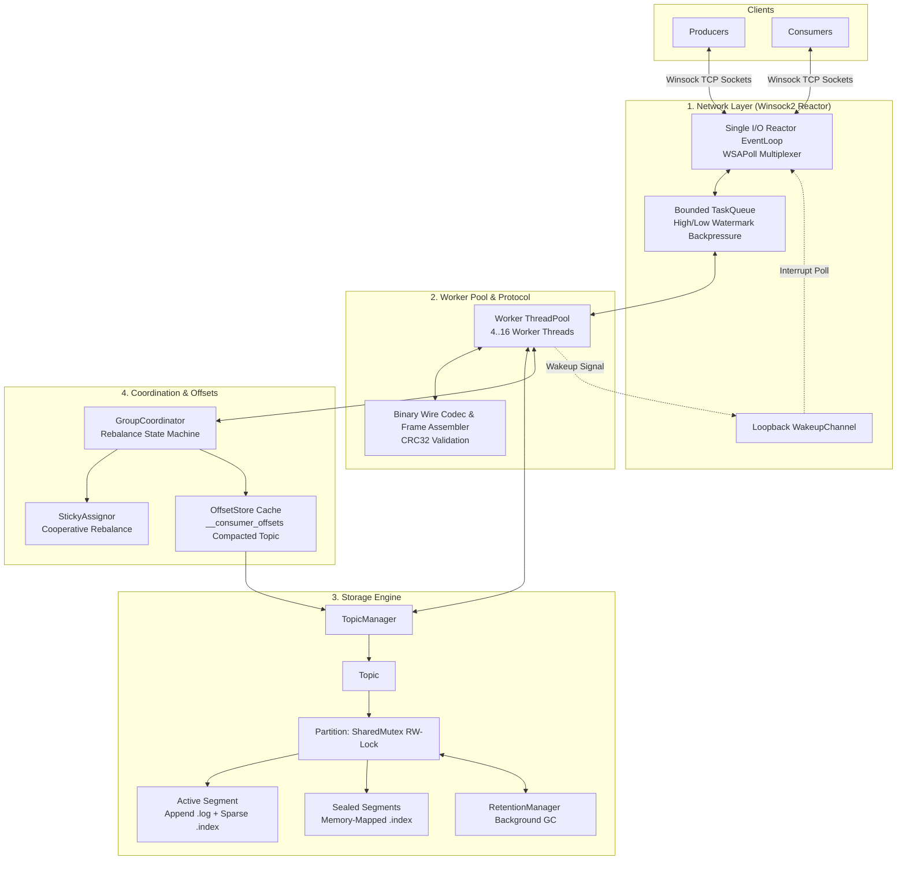

# StreamForge

**A Kafka-Inspired, High-Performance Durable Message Broker in C++17 Running NATIVELY on Windows.**

[](https://en.wikipedia.org/wiki/C%2B%2B17)
[](https://microsoft.com/windows)
[]()
[]()
[]()

StreamForge is an open-source, durable, partitioned message broker built from scratch in modern C++17 to bring the architectural beauty of Apache Kafka to native Microsoft Windows environments. It eliminates POSIX shims, WSL, Docker, and third-party dependencies in favor of native Win32 APIs, Winsock2, and standard library primitives.

---

## Key Highlights

- **Native Windows Mechanical Sympathy:** Built directly on Win32 file handles (`CreateFileW`), memory-mapped files (`CreateFileMappingW` / `MapViewOfFile`), NTFS file pre-allocation (`SetFilePointerEx` + `SetEndOfFile`) to eliminate disk fragmentation, and Slim Reader/Writer Locks (`SRWLOCK`).
- **High-Throughput Asynchronous Reactor:** Single I/O thread driving `WSAPoll` multiplexing with an inter-thread TCP loopback `WakeupChannel`, decoupled from a fixed-worker `ThreadPool`.
- **Dynamic TCP Backpressure:** `TaskQueue` watermark tracking automatically throttles client socket reads and sets zero-window receive buffers (`SO_RCVBUF = 0`) when worker queues saturate.
- **Partitioned Append-Only Storage:** Commit logs structured with fixed-stride 16-byte sparse indices, achieving $O(\log N)$ binary search memory-mapped lookups.
- **Consumer Group Coordination & Sticky Assignor:** Kafka-compatible group rebalancing protocol (`JoinGroup`, `SyncGroup`, `Heartbeat`, `LeaveGroup`) with a cooperative sticky partition assignor and persistent `__consumer_offsets`.
- **Crash Recovery & Retention GC:** Automatic tail-corruption truncation on crash restarts, missing index rebuilding, clean shutdown metadata markers, and background segment retention cleanup (`retention.ms` / `retention.bytes`).

---

## Architecture Overview



---

## Performance Snapshot

*Measured natively on Windows 11 (13th Gen Intel Core i5-13420H, 12 logical cores, NVMe SSD):*

- **Peak Produce Throughput:** **87,037 records/sec** (8.30 MB/sec at 100-byte payloads across 8 connections).
- **Sub-Millisecond Median Latency:** **p50 = 0.81 ms** under high batching.
- **Connection Scalability:** Holds **1,000 concurrent connections** flat at **17 server threads** with **p99 latency < 4.0 ms**.
- **Instantaneous Recovery:** Sub-10 ms crash-recovery startup scan on pre-indexed multi-segment partitions.

For complete reproducible benchmarks and configuration details, see [docs/BENCHMARKS.md](file:///C:/Users/satya/OneDrive/Desktop/StreamForge/docs/BENCHMARKS.md).

---

## Quickstart Guide

### Prerequisites
- **Operating System:** Windows 10 or Windows 11 (64-bit)
- **Compiler:** MinGW GCC/G++ 11+ (MSYS2 UCRT64 recommended) or Visual Studio MSVC 2019+
- **Build System:** CMake 3.16+

### 1. Build StreamForge
Run the build script in PowerShell:
```powershell
.\build.ps1
```
*Builds all binaries (`streamforge_server.exe`, `streamforge_cli.exe`, `streamforge_storage.exe`, `streamforge_bench.exe`, and unit test binaries) with zero compiler warnings (`-Wall -Wextra -Wpedantic`).*

### 2. Start the Message Broker
```powershell
# Start broker on port 9092 with 4 worker threads
.\build\streamforge_server.exe --port 9092 --data-dir .\data --workers 4
```

### 3. Produce and Consume Records (CLI)
Open a separate PowerShell terminal:
```powershell
# Create a topic with 4 partitions
.\build\streamforge_cli.exe --port 9092 create-topic my-topic 4

# Produce messages
.\build\streamforge_cli.exe --port 9092 produce my-topic "Hello StreamForge!" --key "k1"
.\build\streamforge_cli.exe --port 9092 produce my-topic "Second Message" --key "k2"

# Fetch messages from partition 0 starting at offset 0
.\build\streamforge_cli.exe --port 9092 fetch my-topic 0 0 --max 10

# Consume via a coordinated Consumer Group
.\build\streamforge_cli.exe --port 9092 group-join my-group my-topic
```

### 4. Run Verification & Test Suite
```powershell
# Run the master test verification suite (7 test suites, 100% pass)
powershell -ExecutionPolicy Bypass -File .\verify_all.ps1
```

### 5. Run the Automated Benchmark Suite
```powershell
powershell -ExecutionPolicy Bypass -File .\scripts\run_benchmarks.ps1
```

---

## Technical Documentation Index

Detailed architectural and systems documentation is available in the [`docs/`](file:///C:/Users/satya/OneDrive/Desktop/StreamForge/docs/) directory:

- [**High-Level Design (HLD)**](file:///C:/Users/satya/OneDrive/Desktop/StreamForge/docs/HLD.md): 4-layer architecture diagrams, produce/fetch sequence flows, and core design tradeoffs.
- [**Low-Level Design (LLD)**](file:///C:/Users/satya/OneDrive/Desktop/StreamForge/docs/LLD.md): Concrete C++ class diagrams, design patterns, exact on-disk binary layouts, and complete lock inventory table.
- [**Benchmark Suite & Performance Report**](file:///C:/Users/satya/OneDrive/Desktop/StreamForge/docs/BENCHMARKS.md): Full real-world benchmark measurements across 7 scenarios (throughput, latency percentiles, connection scaling, recovery speed, old vs new networking).
- [**Test Coverage Matrix**](file:///C:/Users/satya/OneDrive/Desktop/StreamForge/docs/TEST_COVERAGE.md): 53-point test matrix mapping every architectural requirement across M1–M6 to unit and integration tests.
- [**Technical Interview Preparation Guide**](file:///C:/Users/satya/OneDrive/Desktop/StreamForge/docs/INTERVIEW_PREP.md): 25+ comprehensive interview Q&As covering systems programming, Windows OS internals, storage mechanics, concurrency, and deep dives on the 5 primary system design prompts.

---

## Project Structure

```
StreamForge/
├── include/streamforge/     # Public header files
│   ├── Assignor.hpp         # Cooperative sticky partition assignor
│   ├── ConnectionState.hpp  # Per-connection socket buffers & assembler
│   ├── FileHandle.hpp       # RAII Win32 file handle & memory map wrappers
│   ├── FrameCodec.hpp       # Binary wire frame encoding & decoding
│   ├── GroupCoordinator.hpp # Consumer group state machine & rebalance
│   ├── LogSegment.hpp       # Single append-only .log segment
│   ├── MessageHandler.hpp   # Request router & protocol dispatcher
│   ├── OffsetIndex.hpp      # 16-byte fixed-stride memory-mapped sparse index
│   ├── OffsetStore.hpp      # In-memory cache backed by __consumer_offsets
│   ├── Partition.hpp        # Multi-segment partition with SharedMutex
│   ├── RetentionManager.hpp # Background time & size segment cleaner
│   ├── Socket.hpp           # RAII Winsock2 socket wrapper
│   ├── TaskQueue.hpp        # Bounded queue with watermark backpressure
│   ├── TcpServer.hpp        # Asynchronous WSAPoll reactor server
│   ├── ThreadPool.hpp       # Worker thread pool
│   ├── Topic.hpp            # Topic containing 1..N Partitions
│   ├── TopicManager.hpp     # Topic discovery, recovery & lifecycle
│   └── WakeupChannel.hpp    # Non-blocking loopback notification channel
├── src/                     # Implementation files
├── tests/                   # Storage, protocol, network, and group test suites
├── scripts/                 # Benchmark runners and verification scripts
├── docs/                    # Architectural HLD, LLD, benchmarks, and interview notes
└── CMakeLists.txt           # Top-level CMake configuration
```

---

## Architectural Decisions & Tradeoffs

| Choice | Implemented Approach | Alternative Evaluated | Why? |
|---|---|---|---|
| **Networking** | Single I/O Reactor (`WSAPoll`) + Thread Pool | Thread-per-Connection | Thread-per-connection allocates 1 MB stacks per thread and collapses at hundreds of connections. Reactor scales to 1,000+ idle connections at constant memory. |
| **Storage Engine** | Append-Only `.log` + 16B Sparse `.index` | SQLite / RocksDB | Append-only files eliminate LSM compaction write-amplification and B-Tree rebalancing, maximizing sequential disk write speeds. |
| **Indexing** | Sparse (every 4 KB) + `MapViewOfFile` | Dense In-Memory Hash Map | Keeps index size under 0.4% of log size, allowing binary search to run directly across memory-mapped virtual address space. |
| **Assignor** | Cooperative Sticky Assignor | Static Range Assignor | Eliminates stop-the-world partition revocation storms during consumer rebalances by keeping 80%+ of existing partition assignments intact. |
| **Backpressure** | Watermark-based `SO_RCVBUF = 0` | Dropping incoming packets | Gracefully pauses producer TCP transmission windows rather than dropping records or running out of broker RAM. |

---

## License

StreamForge is released under the MIT License.
