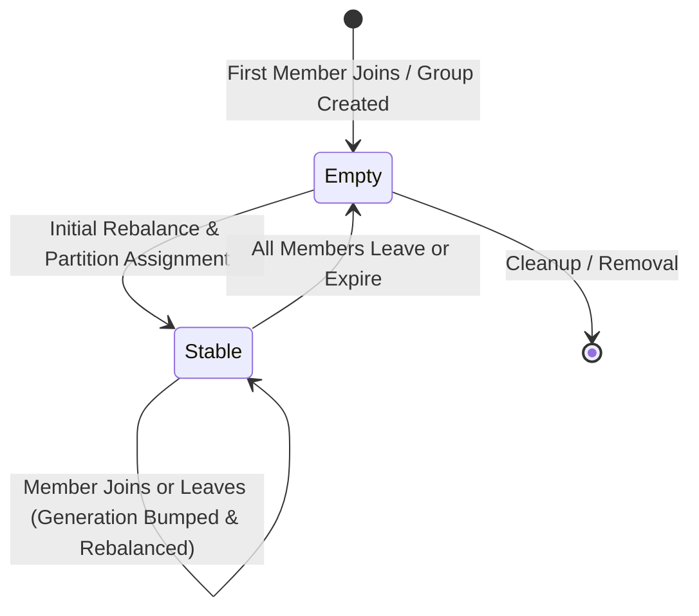
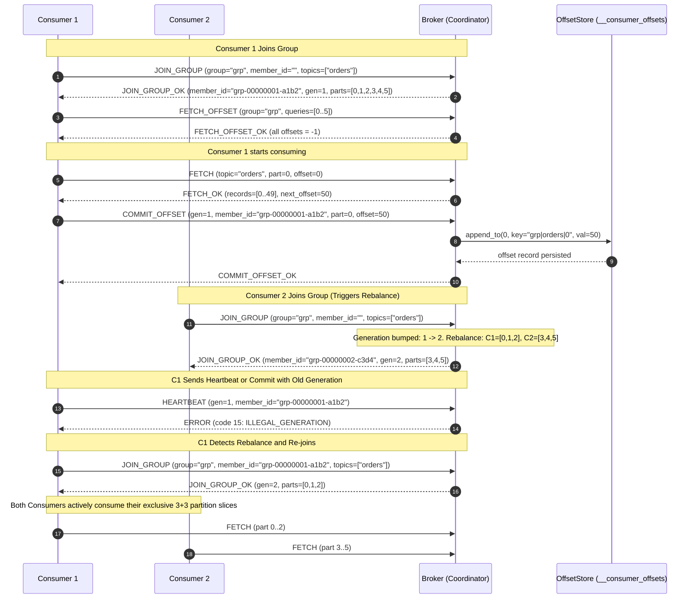

# StreamForge Milestone 5: Consumer Groups & Offset Commits

This document describes the high-level architecture, internal algorithms, concurrency guarantees, and protocol design for Consumer Groups and Offset Commits in StreamForge.

---

## 1. Overview and Core Responsibilities

A **Consumer Group** allows a pool of cooperating consumer processes to coordinate the distributed, parallel consumption of partitioned topics. Key requirements:
- **Partition Assignment**: Every partition of a subscribed topic is assigned to at most one consumer member within the group at any given time (mutually exclusive ownership).
- **Dynamic Rebalancing**: When members join, leave, or die (session timeout), the group coordinator detects the membership change, increments the group generation counter, and redistributes topic partitions evenly among active members.
- **Offset Tracking & Durability**: Committed offsets are stored durably in an append-only internal partition log (`__consumer_offsets`), surviving broker restarts and ungraceful crashes.
- **Fencing & Zombie Defense**: Outdated generation tokens or attempts to commit unassigned partitions are rejected with explicit error codes (`ILLEGAL_GENERATION = 15`, `PARTITION_NOT_ASSIGNED = 16`, `UNKNOWN_GROUP_OR_MEMBER = 14`), preventing zombie consumers from corrupting group progress.

---

## 2. Group Coordinator State Machine

StreamForge implements a deterministic two-state group model:

- **`Empty`**: No active members belong to the group. Committed offsets remain preserved in memory and on disk in `__consumer_offsets`.
- **`Stable`**: At least one active member exists. Every active member holds an exclusive partition assignment computed by the assignor strategy (`Range` or `RoundRobin`).
- **`Generation Counter`**: An unsigned 32-bit monotonically increasing counter. Each rebalance (triggered by `join-group`, `leave-group`, or session timeout expiration via the reaper) increments `generation` by 1.

---

## 3. Partition Assignment Strategies

StreamForge includes two deterministic assignors in [`Assignor.hpp`](include/streamforge/Assignor.hpp):

### 3.1 Range Assignor (`strategy = 0`)
- Partitions for each topic are sorted numerically: `0, 1, ..., N-1`.
- Members are sorted lexicographically by member ID: `M0, M1, ..., MK-1`.
- For each topic, partitions are split into contiguous numeric segments:
  $$\text{num\_per\_member} = \lfloor N / K \rfloor, \quad \text{remainder} = N \pmod K$$
  The first `remainder` members receive $\text{num\_per\_member} + 1$ partitions, and the rest receive $\text{num\_per\_member}$.
- Example with 6 partitions (0..5) and 2 members ($M_0, M_1$):
  - $M_0 \leftarrow [P_0, P_1, P_2]$
  - $M_1 \leftarrow [P_3, P_4, P_5]$

### 3.2 RoundRobin Assignor (`strategy = 1`)
- All topic-partitions across all subscribed topics are collected in canonical order and distributed cyclicly among members:
  $$P_i \to M_{i \pmod K}$$
- Ideal when subscribing to multiple topics with uneven partition counts.

---

## 4. Sequence Diagram: Two Consumers Joining, Consuming, and Rebalancing

---

## 5. Offset Storage Architecture (`__consumer_offsets`)

Committed consumer offsets are treated as first-class durable records inside the storage engine:
- **Internal Topic**: Reserved topic named `"__consumer_offsets"` (1 partition by default).
- **Key Encoding**: Null-free UTF-8 string: `<group_id>|<topic>|<partition>` (e.g. `order_group|orders|2`).
- **Value Encoding**: 16 bytes big-endian:
  - `bytes 0..7`: `uint64_t offset` (the next offset to consume)
  - `bytes 8..15`: `int64_t timestamp_ms` (UNIX epoch commit timestamp)
- **Startup Replay**: During broker initialization, `OffsetStore::recover()` opens `"__consumer_offsets"`, scans all segments sequentially from offset 0, and reconstructs the in-memory cache `std::unordered_map<std::string, uint64_t>`. If any record exhibits torn headers or CRC32 mismatches, recovery returns a fatal `Status::Corruption` error.
- **Client Shielding**: Topic names starting with `"__"` are rejected if accessed by user clients (`CREATE_TOPIC`, `PRODUCE`, `FETCH`, `DESCRIBE_TOPIC` return error code 6 `INVALID_TOPIC_NAME`), and hidden from `LIST_TOPICS`.

---

## 6. Fencing and Validation Semantics

When receiving a `COMMIT_OFFSET` request, the coordinator validates 5 fencing rules in strict order:

1. **Group Existence**: Returns Error 14 (`UNKNOWN_GROUP_OR_MEMBER`) if `group_id` does not exist and member ID was provided.
2. **Standalone vs Member Commits**:
   - If `member_id` is empty and `generation == 0xFFFFFFFF`, the commit is treated as a manual / standalone offset commit (allowed for administrative scripts or uncoordinated consumers).
   - If `member_id` is specified, the member must be registered in the group (Error 14 if unknown).
3. **Generation Matching**:
   - `req.generation` must exactly match `group->generation`. If generation has bumped due to a rebalance or member expiration, commit is rejected with Error 15 (`ILLEGAL_GENERATION`).
4. **Partition Assignment Ownership**:
   - Every partition entry `(topic, partition)` in the commit batch must belong to the member's active assignment in `MemberMetadata::assignment`. If any partition is not owned, the commit is rejected with Error 16 (`PARTITION_NOT_ASSIGNED`).
5. **High Watermark Upper Bound**:
   - The committed offset cannot exceed the partition's current `next_offset` (high watermark) in the storage engine. If exceeded, returns Error 8 (`OFFSET_OUT_OF_RANGE`).

---

## 7. Reaper Thread & Failure Detection

To detect consumer failures without blocking the event loop or workers:
- `TcpServer` spawns a single dedicated background thread (`TcpServer::reaper_loop`).
- Driven by `std::condition_variable::wait_for` with configurable interval (`--reaper-interval-ms`, default 500 ms).
- Invokes `GroupCoordinator::expire_members()`.
- For each member across all groups, if:
  $$\text{now} - \text{last\_heartbeat} > \text{member.session\_timeout\_ms}$$
  The coordinator removes the member, increments group generation, recalculates partition assignments, and transitions group to `Empty` if no members remain.
- The reaper thread joins cleanly and immediately on server shutdown via `request_stop()`.

---

## 8. Architectural Tradeoffs & Production Extensions

| Feature | StreamForge Design | Kafka Production Design | Tradeoff / Rationale |
| :--- | :--- | :--- | :--- |
| **Join Protocol** | Single-phase synchronous `JOIN_GROUP` | Two-phase `JoinGroup` + `SyncGroup` | StreamForge eliminates join-phase blocking and complexity while guaranteeing deterministic range assignment. |
| **Assignor Location** | Server-side (Coordinator computes) | Client-side (Group Leader computes) | Server-side assignment avoids multi-hop roundtrips and client desync bugs. |
| **Offset Compaction** | Append-only partition log with replay | Log compaction (Cleaner thread) | StreamForge relies on linear replay; Milestone 6 will add log retention & segment cleaning. |
| **Rebalance Model** | Eager generation bump | Cooperative Sticky Rebalance | Eager rebalance provides strong barrier synchronization and clean fencing guarantees. |
