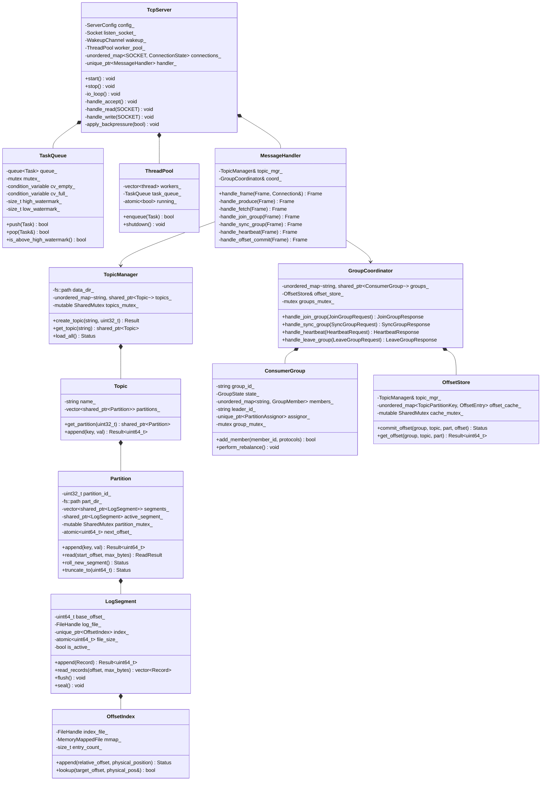

# StreamForge Low-Level Design (LLD)

This document provides the concrete low-level architectural specification for StreamForge, including class structures, design pattern implementations, exact on-disk binary layouts, and a comprehensive lock inventory.

---

## 1. Class Architecture Diagram

The following diagram illustrates the primary classes, interfaces, and ownership relationships across the StreamForge runtime:



---

## 2. Design Patterns & Implementation Mapping

StreamForge applies established systems software engineering patterns to achieve high throughput, strict RAII lifecycle management, and clear isolation of responsibilities:

### A. Reactor Pattern
- **Component:** `TcpServer` ([`include/streamforge/TcpServer.hpp`](include/streamforge/TcpServer.hpp), [`src/TcpServer.cpp`](src/TcpServer.cpp))
- **Role:** Implements an asynchronous event demultiplexer using native Win32 `WSAPoll()`. The single I/O thread monitors listening and connected sockets for `POLLRDNORM` and `POLLWRNORM`. Network events are translated to frame-assembly actions without blocking.

### B. Half-Sync / Half-Async Concurrency Pattern
- **Component:** `TcpServer` (Async layer) $\leftrightarrow$ `TaskQueue` $\leftrightarrow$ `ThreadPool` (Sync layer) ([`include/streamforge/ThreadPool.hpp`](include/streamforge/ThreadPool.hpp), [`src/ThreadPool.cpp`](src/ThreadPool.cpp))
- **Role:** Decouples fast socket I/O from slow synchronous operations (disk writes, fsync, and complex protocol decoding). Sockets remain responsive while worker threads absorb storage latency.

### C. Bounded Producer-Consumer Pattern with Watermark Backpressure
- **Component:** `TaskQueue` ([`include/streamforge/TaskQueue.hpp`](include/streamforge/TaskQueue.hpp))
- **Role:** Bounded thread-safe queue with high-watermark (e.g. 500 tasks) and low-watermark (e.g. 200 tasks). When the queue reaches the high watermark, the I/O reactor suspends reads and sets `SO_RCVBUF = 0`, applying TCP zero-window backpressure to clients.

### D. Resource Acquisition Is Initialization (RAII)
- **Component:** `Socket` ([`include/streamforge/Socket.hpp`](include/streamforge/Socket.hpp)), `FileHandle` ([`include/streamforge/FileHandle.hpp`](include/streamforge/FileHandle.hpp))
- **Role:** Encapsulates raw OS handles (`SOCKET`, Win32 `HANDLE`, `MapViewOfFile` pointers). Destructors guarantee immediate resource cleanup (`closesocket`, `CloseHandle`, `UnmapViewOfFile`) under normal execution or exception handling.

### E. Strategy Pattern
- **Component:** `PartitionAssignor` & `StickyAssignor` ([`include/streamforge/Assignor.hpp`](include/streamforge/Assignor.hpp), [`src/Assignor.cpp`](src/Assignor.cpp))
- **Role:** Abstract partition assignment algorithm. `StickyAssignor` minimizes partition movements across rebalances while ensuring balanced partition ownership across consumers.

### F. State Pattern
- **Component:** `ConsumerGroup` ([`include/streamforge/GroupCoordinator.hpp`](include/streamforge/GroupCoordinator.hpp))
- **Role:** Manages the group lifecycle state machine (`Empty`, `PreparingRebalance`, `CompletingRebalance`, `Stable`, `Dead`). Protocol requests are validated against the current state before triggering transitions.

---

## 3. On-Disk and Wire Binary Formats

All multibyte integers are serialized in **big-endian (network byte order)**.

### A. Network Wire Frame Header (12 Bytes)

```
 0                   1                   2                   3
 0 1 2 3 4 5 6 7 8 9 0 1 2 3 4 5 6 7 8 9 0 1 2 3 4 5 6 7 8 9 0 1
+-+-+-+-+-+-+-+-+-+-+-+-+-+-+-+-+-+-+-+-+-+-+-+-+-+-+-+-+-+-+-+-+
|                          Frame Length                         |  (uint32, bytes 0-3, incl. header)
+-+-+-+-+-+-+-+-+-+-+-+-+-+-+-+-+-+-+-+-+-+-+-+-+-+-+-+-+-+-+-+-+
|          Frame Type           |           Reserved            |  (uint16 type 4-5, uint16 reserved 6-7)
+-+-+-+-+-+-+-+-+-+-+-+-+-+-+-+-+-+-+-+-+-+-+-+-+-+-+-+-+-+-+-+-+
|                          Request ID                           |  (uint32, bytes 8-11)
+-+-+-+-+-+-+-+-+-+-+-+-+-+-+-+-+-+-+-+-+-+-+-+-+-+-+-+-+-+-+-+-+
|                         Payload Body ...                      |  (Length - 12 bytes)
+-+-+-+-+-+-+-+-+-+-+-+-+-+-+-+-+-+-+-+-+-+-+-+-+-+-+-+-+-+-+-+-+
```

| Field Name | Type | Size | Description |
|---|---|---|---|
| `length` | `uint32_t` | 4 bytes | Total size of the frame including the 12-byte header. |
| `type` | `uint16_t` | 2 bytes | Opcode identifying message type (e.g. `PRODUCE=1`, `FETCH=2`, etc.). |
| `reserved` | `uint16_t` | 2 bytes | Alignment and extension flags (defaults to 0). |
| `request_id` | `uint32_t` | 4 bytes | Opaque correlation ID echoed by the server in responses. |

---

### B. On-Disk Record Format (`.log` Files)

```
+-+-+-+-+-+-+-+-+-+-+-+-+-+-+-+-+-+-+-+-+-+-+-+-+-+-+-+-+-+-+-+-+
|                         Record Length                         |  (uint32: 4 bytes)
+-+-+-+-+-+-+-+-+-+-+-+-+-+-+-+-+-+-+-+-+-+-+-+-+-+-+-+-+-+-+-+-+
|  Magic (1B)   |   Attr (1B)   |                               |  (uint8 magic, uint8 attributes)
+-+-+-+-+-+-+-+-+-+-+-+-+-+-+-+-+                               +
|                           Timestamp                           |  (int64: 8 bytes, epoch ms)
+-+-+-+-+-+-+-+-+-+-+-+-+-+-+-+-+-+-+-+-+-+-+-+-+-+-+-+-+-+-+-+-+
|                            Offset                             |  (uint64: 8 bytes, partition offset)
+-+-+-+-+-+-+-+-+-+-+-+-+-+-+-+-+-+-+-+-+-+-+-+-+-+-+-+-+-+-+-+-+
|                           Key Length                          |  (uint32: 4 bytes)
+-+-+-+-+-+-+-+-+-+-+-+-+-+-+-+-+-+-+-+-+-+-+-+-+-+-+-+-+-+-+-+-+
|                            Key Bytes                          |  (variable, 0 to Key Length)
+-+-+-+-+-+-+-+-+-+-+-+-+-+-+-+-+-+-+-+-+-+-+-+-+-+-+-+-+-+-+-+-+
|                          Value Length                         |  (uint32: 4 bytes)
+-+-+-+-+-+-+-+-+-+-+-+-+-+-+-+-+-+-+-+-+-+-+-+-+-+-+-+-+-+-+-+-+
|                           Value Bytes                         |  (variable, 0 to Value Length)
+-+-+-+-+-+-+-+-+-+-+-+-+-+-+-+-+-+-+-+-+-+-+-+-+-+-+-+-+-+-+-+-+
|                             CRC32                             |  (uint32: 4 bytes, IEEE 802.3)
+-+-+-+-+-+-+-+-+-+-+-+-+-+-+-+-+-+-+-+-+-+-+-+-+-+-+-+-+-+-+-+-+
```

| Field Name | Type | Size | Description |
|---|---|---|---|
| `record_length` | `uint32_t` | 4 bytes | Byte length of the record following this field up to the end of CRC32. |
| `magic` | `uint8_t` | 1 byte | Format version identifier (current = `1`). |
| `attributes` | `uint8_t` | 1 byte | Compression and serialization flags (0 = uncompressed). |
| `timestamp` | `int64_t` | 8 bytes | Milliseconds since Unix epoch. |
| `offset` | `uint64_t` | 8 bytes | Monotonically increasing 64-bit log offset within the partition. |
| `key_length` | `uint32_t` | 4 bytes | Length of the record key (0 if key is empty). |
| `key` | `uint8_t[]` | `key_length` | Key payload bytes. |
| `val_length` | `uint32_t` | 4 bytes | Length of the record value (0 if value is empty). |
| `value` | `uint8_t[]` | `val_length` | Value payload bytes. |
| `crc32` | `uint32_t` | 4 bytes | IEEE 802.3 CRC32 computed over all bytes from `magic` through `value`. |

---

### C. Sparse Index Entry Format (`.index` Files)

Each index entry has a **fixed stride of 16 bytes**, enabling $O(1)$ address indexing and $O(\log N)$ binary search directly across memory-mapped files without variable-length decoding:

```
 0                   1                   2                   3
 0 1 2 3 4 5 6 7 8 9 0 1 2 3 4 5 6 7 8 9 0 1 2 3 4 5 6 7 8 9 0 1
+-+-+-+-+-+-+-+-+-+-+-+-+-+-+-+-+-+-+-+-+-+-+-+-+-+-+-+-+-+-+-+-+
|                                                               |
+                        Relative Offset                        +  (uint64, 8 bytes: offset - base_offset)
|                                                               |
+-+-+-+-+-+-+-+-+-+-+-+-+-+-+-+-+-+-+-+-+-+-+-+-+-+-+-+-+-+-+-+-+
|                                                               |
+                       Physical Position                       +  (uint64, 8 bytes: byte offset in .log)
|                                                               |
+-+-+-+-+-+-+-+-+-+-+-+-+-+-+-+-+-+-+-+-+-+-+-+-+-+-+-+-+-+-+-+-+
```

| Field Name | Type | Size | Description |
|---|---|---|---|
| `relative_offset` | `uint64_t` | 8 bytes | Offset delta relative to the segment's `base_offset` ($Offset - BaseOffset$). |
| `physical_position` | `uint64_t` | 8 bytes | Exact byte offset of the record start within the corresponding `.log` file. |

---

### D. Internal Offsets Topic Record (`__consumer_offsets`)

Committed consumer offsets are stored as standard records in the internal `__consumer_offsets` topic:
- **Key Payload:**
  - `group_id` (string: 2B length + utf-8 bytes)
  - `topic` (string: 2B length + utf-8 bytes)
  - `partition` (uint32_t: 4 bytes)
- **Value Payload:**
  - `committed_offset` (uint64_t: 8 bytes)
  - `leader_epoch` (uint32_t: 4 bytes)
  - `metadata` (string: 2B length + utf-8 bytes)
  - `commit_timestamp_ms` (int64_t: 8 bytes)

---

## 4. Comprehensive Lock Inventory & Concurrency Model

StreamForge enforces strict lock ordering and short critical sections. **No mutex is ever held during blocking network socket I/O.**

```
Lock Hierarchy (Acquisition Order):
  Level 1: topics_mutex_ (TopicManager)
    Level 2: partition_mutex_ (Partition)
      Level 3: segment_mutex_ (LogSegment)
```

| Mutex / Synchronization Primitive | Class | Type | Data Protected | Granularity | Held Across Disk I/O? | Lock Order |
|---|---|---|---|---|---|---|
| `topics_mutex_` | `TopicManager` | `SharedMutex` (SRWLock) | `topics_` map (topic creation, lookup) | Entire Broker | No | Level 1 |
| `partition_mutex_` | `Partition` | `SharedMutex` (SRWLock) | Segment list, `active_segment_`, `next_offset_` | Single Partition | Yes (briefly for append write) | Level 2 |
| `groups_mutex_` | `GroupCoordinator` | `std::mutex` | `groups_` map (lookup/create consumer group) | Coordinator | No | Independent |
| `group_mutex_` | `ConsumerGroup` | `std::mutex` | Group state, member list, heartbeats, assignments | Single Consumer Group | No | Independent |
| `cache_mutex_` | `OffsetStore` | `SharedMutex` (SRWLock) | In-memory `offset_cache_` lookup table | Offset Store | No | Independent |
| `queue_mutex_` | `TaskQueue` | `std::mutex` | Task FIFO queue, empty/full CV state | Task Queue | No | Independent |
| `connections_mutex_` | `TcpServer` | `std::mutex` | Connection map (add/remove client sockets) | Reactor | No | Independent |

### Deadlock Prevention Rules:
1. **Never acquire a higher-level lock while holding a lower-level lock.** (E.g., never acquire `topics_mutex_` while holding `partition_mutex_`).
2. **Reader-Writer Separation:** Appends to a partition acquire exclusive write locks (`std::unique_lock<SharedMutex>`), while reads acquire shared read locks (`std::shared_lock<SharedMutex>`), allowing concurrent consumers to read from the same partition simultaneously.
3. **Decoupled Outbound Buffering:** Worker threads queue responses into connection outbound queues under brief spin/mutex locks and notify the reactor via non-blocking loopback sockets (`WakeupChannel`).
